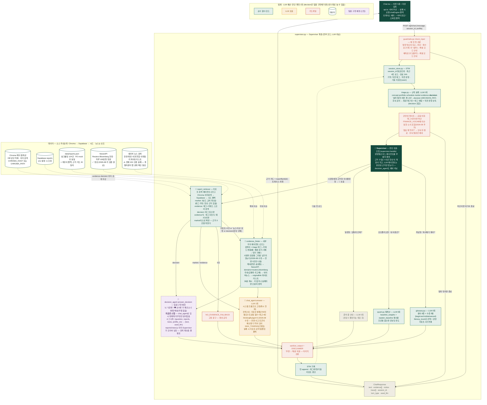

# Quill 챗봇 아키텍처 — Supervisor + 2 검색 에이전트 + 해설 2종 (실구현 기준)

```
Supervisor (supervisor.py — 질문 판단·호출·조립, 코드)
  ├─ 🤖 report_retriever  — 크로마/Supabase/시드에서 리포트 근거
  ├─ 🤖 evidence_finder   — NewsAPI(해외)·네이버(국내)에서 외부 지식
  ├─ 💬 chat_agent         — 일반 해설 (LLM 1회, market/evidence형)
  └─ 💬 decision_agent     — 의사결정형 해설 (팀원 구현 예정 — 지금은
                              chat_agent로 임시 대체된 스텁)
문장 생성만 LLM이 담당 — 검색 에이전트(report_retriever/evidence_finder)는 전부 코드다.
```

아래 다이어그램은 상상도가 아니라 **현재 코드에 실제로 존재하는 것만** 그린 것.
GitHub·Notion·mermaid.ai에 그대로 붙여넣으면 렌더링된다.



## 파일 ↔ 노드 대응

| 노드 | 파일 | LLM |
|------|------|-----|
| 가드레일 | `guardrails.py` (check_input / sanitize_output / is_finance_related) | 0 |
| STM | `session_store.py` | 0 |
| triage | `triage.py` (decision 라우팅 포함) | 0 |
| 용어 사전 | `glossary.py` | 0 |
| 포트폴리오 조회 | `quant.py` 재사용 | 0 |
| 리포트 검색 에이전트 | `report_retriever.py` (Chroma→Supabase→시드) | 0 |
| 일반 해설 | `chat_agent.answer` | 1 |
| 의사결정형 해설 | `decision_agent.answer_decision` (스텁 — 팀원 구현 예정) | 0~1 (현재 chat_agent 위임) |
| 외부 지식 에이전트 | `evidence_finder.py` (NewsAPI/네이버+화이트리스트+캐시, 태그→키워드 변환) | 0 |
| 관련성 게이트 | `guardrails.is_finance_related` | 0 |
| Supervisor | `supervisor.py` (판단·호출·조립, decision 근거 수집 포함) | 0 |

## 팀원이 `decision_agent.py`에 꽂을 때

- `answer_decision(question, reports, news, profile_ctx) -> (text, used_llm)` 시그니처만 유지하면 내부 구현은 자유.
- `reports`(report_retriever가 모은 근거)·`news`(evidence_finder가 모은 보조 근거)는 이미 Supervisor가 검색해서 넘겨준다 — 이 함수 안에서 검색 API를 다시 부를 필요 없음.
- 반환 텍스트는 `sanitize_output`+`DISCLAIMER`까지 붙은 완성본이어야 한다 (`chat_agent.answer`와 동일 계약) — Supervisor는 그대로 화면에 낸다.
- 절대 규칙(근거 밖 내용 금지·매수/매도 지시 금지·리포트 우열 안 가림)은 두 페르소나 모두 공통 적용.

## 발표 포인트 3줄

1. LLM은 문장을 만드는 마지막 한 칸에만 있다 — 분류·검색·계산·검증은 전부 코드.
2. 어떤 실패에도 답은 나간다 — LLM 죽으면 템플릿, 근거 없으면 고정 폴백, 서버 죽으면 FE 목업.
3. 매수 고민("뭐 사?", "살까 말까?")도 막지 않는다 — 종목을 찍어주는 대신 시장 정세와 리포트 근거를 해설하고, 판단은 사용자에게. 의사결정형은 낙관/보수 두 관점 병렬 해설로 확장 예정(현재 라우팅·근거 수집은 완료, 두 페르소나 로직은 팀원 구현 중).

## 관련 문서

- `docs/backend-handoff.md` — 환경변수(`.env`) 전체 구조 + 트러블슈팅 모음 (Gemini 모델 문제로 답이 깨지는 경우, 조용히 실패하는 지점들 등)
- `docs/decision-agent-handoff.md` — 의사결정형 담당 팀원용 인터페이스 계약
