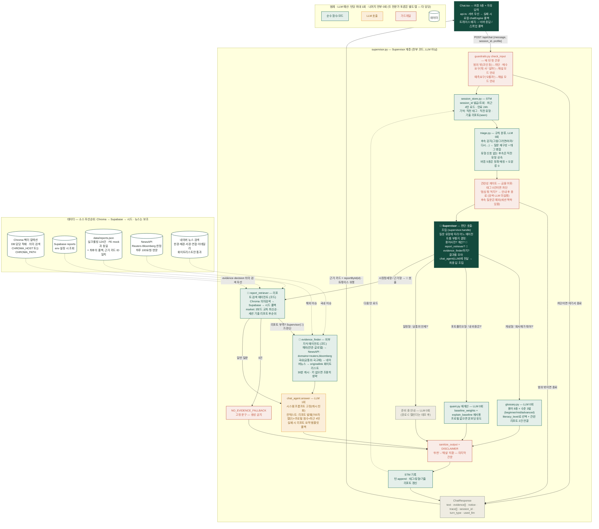

# Quill 챗봇 아키텍처 — Supervisor + 2 검색 에이전트 (실구현 기준)

```
Supervisor (supervisor.py — 질문 판단·호출·조립, 코드)
  ├─ 🤖 report_retriever  — 크로마/Supabase/시드에서 리포트 근거
  └─ 🤖 evidence_finder   — NewsAPI(해외)·네이버(국내)에서 외부 지식
문장 생성만 chat_agent(LLM)가 담당 — 검색 에이전트들은 전부 코드다.
```

아래 다이어그램은 상상도가 아니라 **현재 코드에 실제로 존재하는 것만** 그린 것.
GitHub·Notion·mermaid.ai에 그대로 붙여넣으면 렌더링된다.



## 파일 ↔ 노드 대응

| 노드 | 파일 | LLM |
|------|------|-----|
| 가드레일 | `guardrails.py` (check_input / sanitize_output) | 0 |
| STM | `session_store.py` | 0 |
| triage | `triage.py` | 0 |
| 용어 사전 | `glossary.py` | 0 |
| 포트폴리오 조회 | `quant.py` 재사용 | 0 |
| 리포트 검색 에이전트 | `report_retriever.py` (Chroma→Supabase→시드) | 0 |
| 해설 | `chat_agent.answer` | 1 |
| 외부 지식 에이전트 | `evidence_finder.py` (NewsAPI/네이버+화이트리스트+캐시) | 0 |
| 관련성 게이트 | `guardrails.is_finance_related` | 0 |
| Supervisor | `supervisor.py` (판단·호출·조립) | 0 |

## 발표 포인트 3줄

1. LLM은 문장을 만드는 마지막 한 칸에만 있다 — 분류·검색·계산·검증은 전부 코드.
2. 어떤 실패에도 답은 나간다 — LLM 죽으면 템플릿, 근거 없으면 고정 폴백, 서버 죽으면 FE 목업.
3. 매수 고민("뭐 사?")도 막지 않는다 — 종목을 찍어주는 대신 시장 정세와 리포트 근거를 해설하고, 판단은 사용자에게. (두 전문가 토론 뷰는 별도 탭에서 제공 예정)
